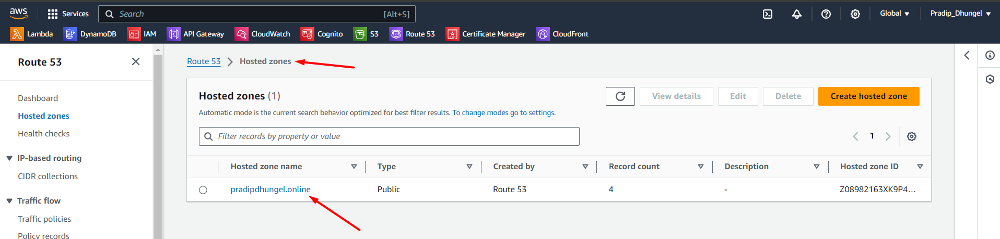

# Project Setup Overview

## 1. Template Selection
- Initially, a template was chosen for the project, likely for a website or application.

## 2. GitHub Setup
- GitHub repository was set up to host the project's source code.

-  Creating a repository and pushing the code to GitHub https://github.com/pradipdhungel/Pradip_Dhungel_ProtfolioX

## 3. S3 Bucket Creation
- An S3 (Simple Storage Service) bucket on AWS was created.

- This bucket is intended to store and manage project assets and files.

## 4. AWS Credentials Configuration in GitHub
- AWS credentials for the IAM user 'UserS3WithGithub' were configured in the GitHub repository settings:
  - `AWS_ACCESS_KEY_ID`
  - `AWS_SECRET_ACCESS_KEY`
  - `AWS_S3_BUCKET`

- These credentials are associated with the IAM user specifically created for this project, enhancing security measures.
- These credentials are used for authentication and authorization when interacting with AWS services, particularly S3.
## 5. CloudFront Setup
- CloudFront distribution was created to deliver content with low latency and high data transfer speeds.

## 6. IAM (Identity and Access Management) Configuration
- IAM was set up to manage access to AWS services securely.

## 7. Certificate Manager
- AWS Certificate Manager was used to manage SSL/TLS certificates for secure communication.

## 8. Route 53 Configuration
- Route 53, AWS's scalable domain name system (DNS) web service, was configured to manage domain names.

## 9. Domain Acquisition
- A domain was acquired from GoDaddy for $1.17 to associate with the project.

## 10. Backend Implementation
- AWS Lambda functions will be utilized for backend functionality.

- DynamoDB will be used to save and manage data securely.

# History for Pradip_Dhungel_ProtfolioX Domain

https://www.pradipdhungel.online/
~~~~
### Commit History

#### Commits on Jan 15, 2024
- Added some content in readme
  - *Author:* pradipdhungel
  - *Committed:* 1 minute ago
- Added readme file without content
  - *Author:* pradipdhungel
  - *Committed:* 1 hour ago

#### Commits on Jan 14, 2024
- Minor changes website link href update
  - *Author:* pradipdhungel
  - *Committed:* yesterday
- Minor changes website link href
  - *Author:* pradipdhungel
  - *Committed:* yesterday
- Minor changes website link
  - *Author:* pradipdhungel
  - *Committed:* yesterday
- Minor changes with img src pradip.jpg
  - *Author:* pradipdhungel
  - *Committed:* yesterday
- Minor changes
  - *Author:* pradipdhungel
  - *Committed:* yesterday
- YAML set for AWS S3 bucket use
  - *Author:* pradipdhungel
  - *Committed:* yesterday

#### Commits on Jan 13, 2024
- Add blog content
  - *Author:* pradipdhungel
  - *Committed:* 2 days ago

#### Commits on Jan 8, 2024
- Remove unused comment
  - *Author:* pradipdhungel
  - *Committed:* last week
- Added Experience, Education, and Certification
  - *Author:* pradipdhungel
  - *Committed:* last week
- Added blog AWS Medium
  - *Author:* pradipdhungel
  - *Committed:* last week

#### Commits on Jan 7, 2024
- Client-side validation and success/error messages - 2 points
  - *Author:* pradipdhungel
  - *Committed:* last week
- Project setup
  - *Author:* pradipdhungel
  - *Committed:* last week

**End of commit history for this file**
